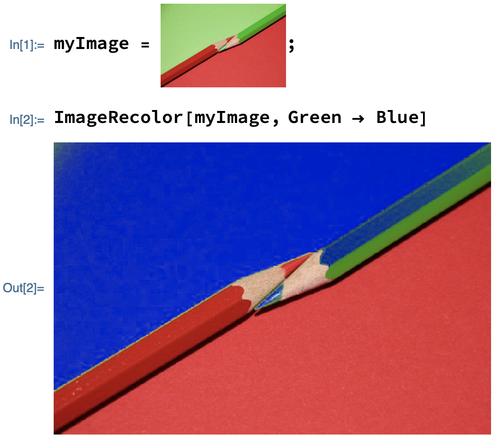

## Changing a colour

--- task ---

If you have never used the Wolfram Language before, follow [this guide to get started](https://projects.raspberrypi.org/en/projects/getting-started-with-mathematica) and learn to use the tool. Look at the sections **Starting Mathematica** and **Programming in Mathematica**.

--- /task ---

To start, you will pick a colour from an image and switch it with another colour.

--- task ---

Find an image and drag it into your notebook.
Your image should be fairly simple, with bright colours.

Alternatively, evaluate the following code to get an example image.

```
CloudGet["https://www.wolframcloud.com/obj/RasPi/Pencils"]
```

--- /task ---

--- task ---

Give your image a name, such as `myImage`. Follow it with a semicolon (`;`) to hide the output and evaluate it.

```
myImage = <your image>;
```

--- /task ---

The image has now been assigned to the name you have chosen.

You can now use `ImageRecolor` to swap a colour in your image.

--- task ---

Choose a colour that stands out in your image. (In the case of the pencil image, this might be `Red` or `Green`.)

Use `ImageColor` to swap that colour with another one of your choice.

```
ImageRecolor[myImage, <first colour> -> <second colour>]

```



--- /task ---

Rather than judging it by sight, you can find the main colours of an image with `DominantColors`.

--- task ---

Use `DominantColors` to find and change each of the dominant colours in your image.
(The coloured squares produced by `DominantColors`--called **swatches**--can be copied directly into `ImageRecolor`.)


```
DominantColors[myImage]
```


--- /task ---