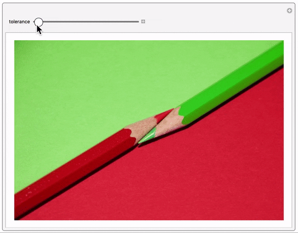
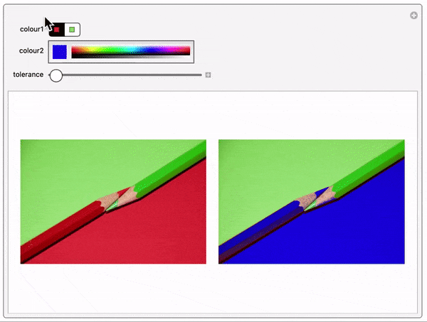

## Creating a tool

In the last step, you were tasked with changing the tolerance level. Each time you changed the it, you had to reevaluate the code--and also remember how the image had changed between evaluations.
This process can be made easier with `Manipulate`.
`Manipulate` allows you to change a value (or several) with just the drag of your mouse.

--- collapse ---
---
title: Manipulates explained
---

`Manipulate` creates a tool that allows you to change a **parameter** in an **expression** without having to reevaluate the expression several times.

By default, the tool creates a slider for every parameter you wish to change.


This all sounds a bit complicated, so let's do some examples.

--- task ---

Evaluate this code and drag the slider in the output.
The number should increase continuously.

Try changing the minimum and maximum.

```
Manipulate[
x + 2, (* expression *)
{x (* parameter *), 1 (* min *), 10 (* max *)}
]
```

--- /task ---

--- task ---

Evaluate this code and drag the slider in the output.
The number should now increase in steps of 1.

Try changing the step size.

```
Manipulate[
x + 2,
{x, 1, 10, 1 (* step size *)}
]
```

--- /task ---

--- task ---

Evaluate this code and drag the sliders in the output.
The number should now increase by different amounts depending on which slider you use.

Try adding more parameters.

```
Manipulate[
x + y,
{x, 1, 10},
{y, 1, 10, 1}
]
```

--- /task ---

--- /collapse ---

You can now create a tool with a slider that changes the tolerance level in your code.

--- task ---

Use `Manipulate` to change the tolerance level.

```
Manipulate[
    ImageRecolor[
        myImage,
        ColorsNear[<first colour>, tolerance] -> <second colour>
    ],
    {tolerance, <min>, <max>, <step>}
]
```



--- /task ---

Parameters in `Manipulate` don't have to be numbers. They can be just about anything: words, pictures, sounds--you name it.

Most importantly in your case, they can also be colours.

--- task ---

Add parameters for the first and second colour in your tool.



--- hints ---

--- hint ---

How do you express a minimum or maximum colour for some colour parameter?
You can't! What you **can** do is provide a list of colours to choose from:

```
{colourParameter, {<colour 1>, <colour 2>, ...}}
```

--- /hint ---

--- hint ---

There's another way. The following code creates a `ColorSlider` that starts on a given colour:

```
{colourParameter, <colour>}
```

Click and drag your mouse over the rainbow-coloured palette to choose any colour you like.

--- /hint ---

--- hint ---

Here's the full code. A number of settings have been chosen for you:

+ The tolerance parameter goes from 0.1 to 1 in steps of 0.1.
+ For the first colour parameter, the dominant colours from the image are used as a list of colours to choose from.
+ For the second colour parameter, a colour slider is used, starting on Blue.

```
Manipulate[
    ImageRecolor[
        myImage,
        ColorsNear[colour1, tolerance] -> colour2
    ],
    {tolerance, 0.1, 1, 0.1},
    {colour1, DominantColors[myImage]},
    {colour2, Blue}
]
```

--- /hint ---

--- /hints ---

--- /task ---

Congratulations! You have created your own colour-changing tool.