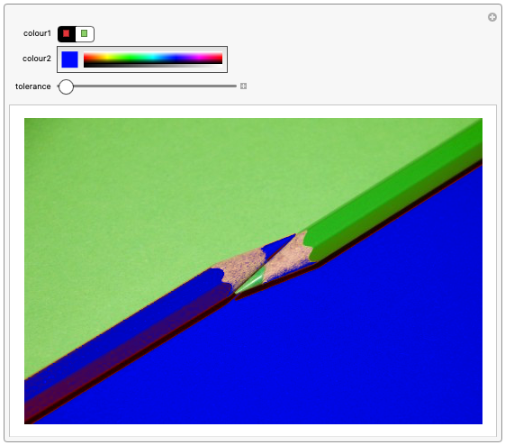

TODO: ADD A CHALLENGE?

 - Can you show the original image and the modified image side by side? (Hint: use `GraphicsGrid` and use the `ImageSize` option to increase the size of the images)

 - Can you create a function for your tool?
Your function should allow you to:
+ choose an image
+ choose the number of dominant colours

