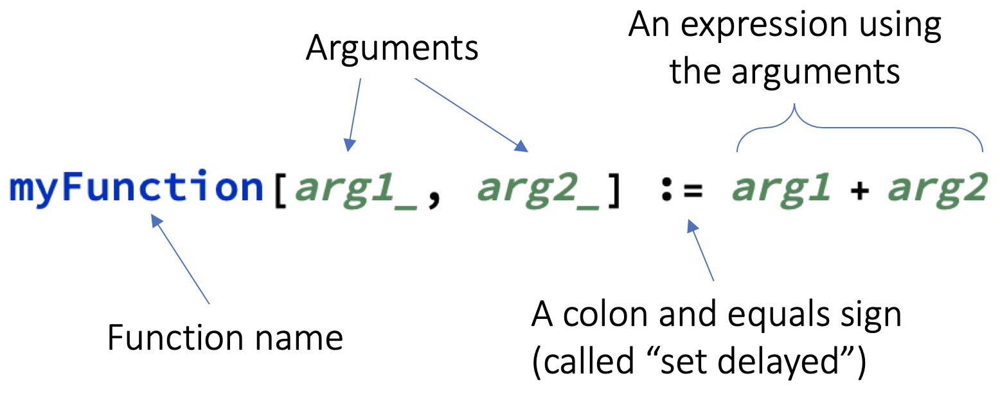
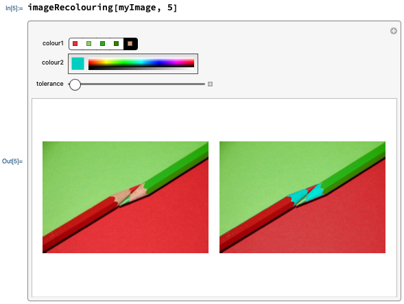

Challenge: improve your tool

You can widen the scope of your tool.

+ Show the original image and the modified image side by side.
+ Turn your tool into a function. Your function should allow you to:
  + choose an image
  + choose the number of dominant colours

--- collapse ---
---
title: Custom functions explained
---

The Wolfram Language is made up of thousands of functions, each of which is able to perform a small number of actions. (You have already used several built-in functions: `ImageRecolor`, `ColorsNear`, `Manipulate`, etc.)

However, there isn't a function for everything. If there's a particular action you want to carry out, but no existing function for it, you can create your own.
Having your own function is especially convenient if you want to carry out an action multiple times.

Here's an example of a basic function which adds two numbers together:



**Important notes:**
+ The arguments inside the square brackets must be followed by underscores (`_`)
+ You must use `:=` (`SetDelayed`), not just `=` (`Set`)
+ Begin your function name with lowercase letter so as not to confuse it with a built-in function
+ You must evaluate your function before it can be applied

--- task ---

This function capitalises all of the words in a sentence, then makes them italic.

```
wordStyler[words_] := Style[Capitalize[words, "AllWords"], Italic]
```

Apply the function to the sentence "the quick brown fox jumps over the lazy dog".

--- hints ---

--- hint ---

Remember to evaluate the function before applying it.
Here is the code you need:

```
wordStyler["the quick brown fox jumps over the lazy dog"]
```

--- /hint ---

--- /hints ---

--- /task ---

--- task ---

This function puts a frame around an expression a given number of times.

```
nestedFrame[expression_, number_] := Nest[Framed, expression, number]
```

Apply the function to `x` five times.

--- hints ---

--- hint ---

Remember to evaluate the function before applying it.
Here is the code you need:

```
nestedFrame[x, 5]
```

--- /hint ---

--- /hints ---

--- /task ---

--- /collapse ---

--- hints ---

--- hint ---

Use `GraphicsGrid` to show both images together and use the `ImageSize` option to increase the size of the images.

--- /hint ---

--- hint ---

Here's a template to start off your function:

```
imageRecolouring[image_, numberOfColours_] := <Manipulate code>
```

--- /hint ---

--- /hints ---

